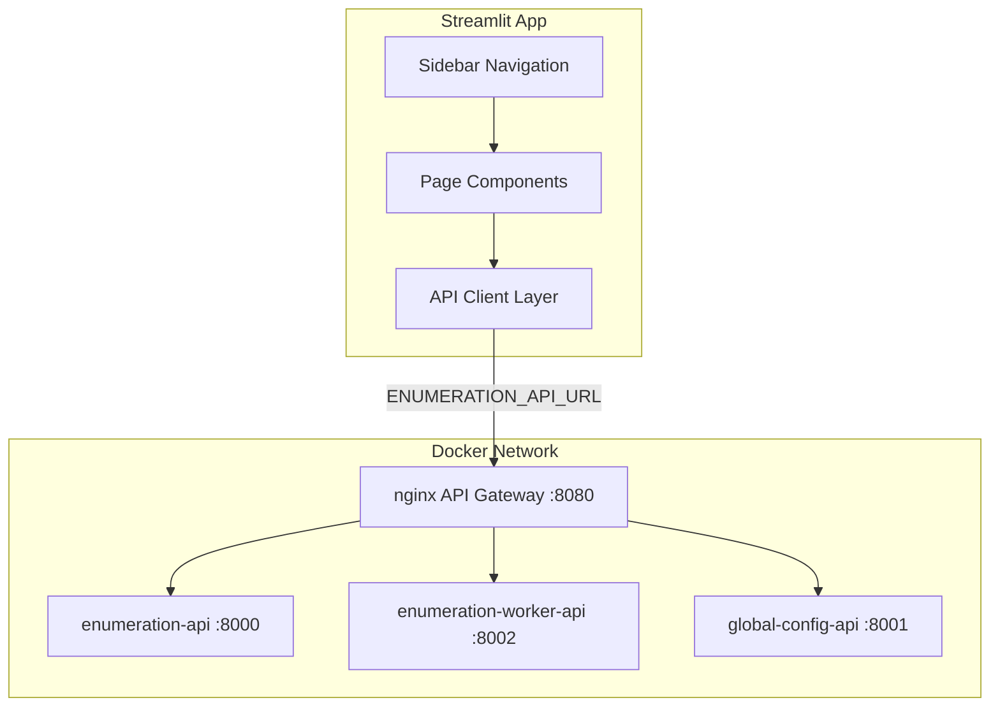

# Design Document: Streamlit Settings Page

## Overview

The Streamlit Settings Page is a multi-page frontend application that provides a management UI for the portioning tool system. It replaces the legacy `app.py` single-page file-upload workflow with a structured, API-driven interface.

The app connects to three backend services through the nginx API gateway:
- **Enumeration API** (`/api/enumeration/`) — CRUD for Buckets, SKUs, Cut Strategies, and Mixes
- **Worker API** (`/api/enumeration-worker/`) — Job submission and monitoring
- **Config API** (`/api/config/`) — System configuration parameters

The app is a pure frontend: it holds no persistent state of its own and delegates all data operations to the backend APIs.

---

## Architecture



The app is structured as a standard Streamlit multi-page application using the `pages/` directory convention. Each page is a self-contained Python module. A shared `api_client.py` module handles all HTTP communication.

**Key design decisions:**
- All API base URLs are read from environment variables with localhost fallbacks, enabling the same image to run in Docker Compose or locally.
- The API client raises typed exceptions on HTTP errors so page components can catch and display them without crashing.
- Streamlit session state is used to cache API responses within a session and to track UI state (selected row, edit mode, batch edit buffer).

---

## Components and Interfaces

### Directory Structure

```
streamlit-app/
├── app.py                  # Entry point: st.set_page_config + sidebar nav
├── pages/
│   ├── 1_Buckets.py
│   ├── 2_SKUs.py
│   ├── 3_Cut_Strategies.py
│   ├── 4_Mix_Visualization.py
│   ├── 5_Mix_Generation.py
│   └── 6_Global_Config.py
├── api_client.py           # HTTP client for all three APIs
└── requirements.txt
```

### API Client (`api_client.py`)

The client reads base URLs from environment variables:

```python
ENUMERATION_API_URL = os.getenv("ENUMERATION_API_URL", "http://localhost:8080/api/enumeration")
WORKER_API_URL      = os.getenv("WORKER_API_URL",      "http://localhost:8080/api/enumeration-worker")
CONFIG_API_URL      = os.getenv("CONFIG_API_URL",      "http://localhost:8080/api/config")
```

Public interface (all functions raise `APIError` on non-2xx responses):

```python
# Buckets
def search_buckets(criteria: dict) -> list[dict]
def create_bucket(payload: dict) -> dict
def update_bucket(bucket_id: str, payload: dict) -> dict
def delete_bucket(bucket_id: str) -> dict

# SKUs
def search_skus(criteria: dict) -> list[dict]
def create_or_update_sku(payload: dict) -> dict
def delete_sku(sku_id: str) -> dict
def batch_import_skus(skus: list[dict], validate_only: bool = False) -> dict

# Cut Strategies
def search_cut_strategies(criteria: dict) -> list[dict]
def create_cut_strategy(payload: dict) -> dict
def update_cut_strategy(strategy_id: str, payload: dict) -> dict
def delete_cut_strategy(strategy_id: str) -> dict

# Mixes
def search_mixes(criteria: dict) -> list[dict]

# Jobs
def list_jobs(status_filter: str | None = None) -> list[dict]
def get_job(job_id: str) -> dict
def submit_job(payload: dict) -> dict
def cancel_job(job_id: str) -> dict

# Config
def get_all_configs() -> list[dict]
def update_config(key: str, payload: dict) -> dict
def batch_update_configs(configs: list[dict], validate_only: bool = False) -> dict
```

`APIError` carries the HTTP status code and the `detail` string from the response body, enabling pages to surface the exact backend error message.

### Page Components

Each page follows the same pattern:
1. Load data from the API on page open (or on explicit Refresh).
2. Display data in a `st.dataframe`.
3. Provide create/edit/delete controls below or beside the table.
4. Wrap all API calls in `try/except APIError` and call `st.error(e.detail)`.

**Buckets page** — table of `_id`, `minWeight`, `maxWeight`; inline create/edit form with client-side validation (`minWeight < maxWeight`); delete with warning display.

**SKUs page** — search form with `prodPlant`, `birdSize`, `customerType`, `productType` filters; full SKU table; create/edit form with weight validation; bulk import section accepting CSV/JSON upload.

**Cut Strategies page** — table of `name`, `mfgType`, `hasNugget`, `beltSpeed`, `parts`; create/edit form with `st.multiselect` for `PartCode` values; duplicate-parts validation; cascade delete summary.

**Mix Visualization page** — filter panel for all `MixSearchCriteria` fields; results table; expandable row detail showing full `skus` map.

**Mix Generation page** — job submission form; job list table with status badges; selected-job detail panel with stage progress; Cancel button gated on job status.

**Global Config page** — grouped config table (grouped by key prefix); inline edit with type-appropriate input controls; bounds enforcement; batch edit mode with validate-only option.

---

## Data Models

The frontend works with the JSON representations of the backend Pydantic models. All field names use camelCase (the alias form) as serialized by the APIs.

### Bucket
```json
{ "_id": "string", "minWeight": float, "maxWeight": float }
```

### SKU
```json
{
  "tradeNumber": "string", "customerName": "string", "customerType": "string",
  "productType": "string", "unitsPerCut": int, "prodPlant": "string",
  "minWeight": float, "maxWeight": float, "targetWeight": float,
  "birdSize": "string", "allowedParts": ["string"]
}
```

### CutStrategy
```json
{
  "_id": "string", "name": "string", "description": "string",
  "mfgType": "DSI|DB20", "hasNugget": bool, "beltSpeed": float,
  "parts": ["D"|"R"|"M"|"T"|"V"|"K"|"S"|"U"|"C"|"J"|"W"|"G"]
}
```

### MIX
```json
{
  "_id": "string", "skus": {"tradeNumber": "partCode"},
  "includesFDS": bool, "includesRTL": bool, "includesNug": bool,
  "nuggetTargetWeight": float|null, "numFillets": int, "filletWeight": float,
  "mfgType": "DSI|DB20", "reqPlant": "string", "reqBirdSize": "SB|BB|ALL",
  "cutStrategyID": "string", "beltSpeed": float
}
```

### Job (JobStatusResponse)
```json
{
  "jobId": "string", "status": "pending|running|completed|failed|cancelled",
  "runId": "string", "createdAt": "datetime", "updatedAt": "datetime",
  "startedAt": "datetime|null", "finishedAt": "datetime|null",
  "skuCount": int, "maxCombinationSize": int,
  "plantFilter": "string|null", "birdSizeFilter": "string|null",
  "stages": [{"stage": int, "status": "string", "totalCombinations": int, "processedCombinations": int}],
  "errorMessage": "string|null"
}
```

### Config
```json
{
  "key": "string", "value": int|float|str|bool,
  "valueType": "int|float|string|bool", "description": "string",
  "updatedAt": "datetime", "minValue": float|null, "maxValue": float|null
}
```

### Client-Side Validation Rules

| Entity | Rule |
|---|---|
| Bucket | `minWeight < maxWeight` |
| SKU | `minWeight < maxWeight` and `minWeight <= targetWeight <= maxWeight` |
| CutStrategy | `parts` list contains no duplicates |
| Job | `1 <= maxCombinationSize <= 4`; `batchSize >= 1`; warn if both filters absent |
| Config | value within `[minValue, maxValue]` when both are defined |

---

## Correctness Properties

*A property is a characteristic or behavior that should hold true across all valid executions of a system — essentially, a formal statement about what the system should do. Properties serve as the bridge between human-readable specifications and machine-verifiable correctness guarantees.*

### Property 1: API errors are always surfaced as messages

*For any* API client function call that raises an `APIError`, the page component that invoked it should display a non-empty error message to the user and not raise an unhandled exception.

**Validates: Requirements 1.4**

---

### Property 2: Bucket weight validation rejects invalid ranges

*For any* pair `(minWeight, maxWeight)` where `minWeight >= maxWeight`, the bucket create/edit form validation function should return a validation error and not produce a valid payload.

**Validates: Requirements 3.6**

---

### Property 3: SKU weight validation enforces all three constraints

*For any* triple `(minWeight, targetWeight, maxWeight)`, the SKU form validation function should accept the triple if and only if `minWeight < maxWeight` and `minWeight <= targetWeight <= maxWeight`.

**Validates: Requirements 4.7**

---

### Property 4: CSV/JSON file parsing produces valid SKU payloads

*For any* well-formed CSV or JSON file containing SKU records, parsing the file should produce a list of dicts where every record contains all required SKU fields with the correct types.

**Validates: Requirements 4.5**

---

### Property 5: Cut strategy parts duplicate validation

*For any* parts list submitted in the cut strategy form, the validation function should reject the list if and only if it contains duplicate `PartCode` values.

**Validates: Requirements 5.7**

---

### Property 6: Job filter warning fires when both filters are absent

*For any* job submission where both `plantFilter` and `birdSizeFilter` are absent (None or empty string), the form should produce a warning and not silently submit without it.

**Validates: Requirements 7.4**

---

### Property 7: Job maxCombinationSize validation

*For any* integer value `n`, the job form validation should accept `n` if and only if `1 <= n <= 4`.

**Validates: Requirements 7.5**

---

### Property 8: Job batchSize validation

*For any* integer value `n`, the job form validation should accept `n` if and only if `n >= 1`.

**Validates: Requirements 7.6**

---

### Property 9: Cancel button visibility matches job status

*For any* job, the Cancel button should be visible if and only if the job's status is `"pending"` or `"running"`. For jobs with status `"completed"`, `"failed"`, or `"cancelled"`, no Cancel button should be rendered.

**Validates: Requirements 9.1, 9.4**

---

### Property 10: Config parameters are grouped by key prefix

*For any* list of `Config` objects, the grouping function should partition them such that all configs whose key shares the same prefix (portion before the first `.`) appear in the same group, and configs with different prefixes appear in different groups.

**Validates: Requirements 10.2**

---

### Property 11: Config input control type matches valueType

*For any* `Config` object, the function that selects the input widget type should return a number input for `"int"`, a decimal input for `"float"`, a text input for `"string"`, and a checkbox for `"bool"`.

**Validates: Requirements 11.1**

---

### Property 12: Config bounds enforcement

*For any* `Config` object with `minValue` and/or `maxValue` defined, the bounds validation function should reject any submitted value that falls outside `[minValue, maxValue]` and accept any value within the range.

**Validates: Requirements 11.2**

---

## Error Handling

All API calls are wrapped in `try/except APIError`. The `APIError` class carries:
- `status_code: int` — the HTTP status code
- `detail: str` — the `detail` field from the JSON error body

Page components handle errors as follows:

| Scenario | Handling |
|---|---|
| Network error / timeout | `st.error("Could not reach [service name]. Check your connection.")` |
| 404 Not Found | `st.warning("Resource not found.")` |
| 409 Conflict | `st.error(e.detail)` — surfaces the backend conflict message |
| 422 Validation | `st.error(e.detail)` — surfaces the backend validation message |
| 500 Server Error | `st.error("Server error. Check backend logs.")` |
| Client-side validation failure | `st.warning(message)` — shown inline before the API call is made |

The app never calls `st.stop()` on an API error; it displays the message and allows the user to retry.

---

## Testing Strategy

### Dual Testing Approach

Both unit tests and property-based tests are required. Unit tests cover specific examples, integration points, and edge cases. Property tests verify universal correctness across randomized inputs.

### Unit Tests

Unit tests use `pytest` with `unittest.mock` to mock the API client. They cover:
- Page load triggers the correct API call (one test per page)
- Form submission with valid data triggers the correct API call
- API error responses result in `st.error` being called with the correct message
- Specific edge cases: empty search results, cascade delete summary display, job status badges, batch import summary display

For Streamlit component testing, use `streamlit.testing.v1.AppTest` to render pages and assert on rendered output.

### Property-Based Tests

Property tests use **Hypothesis** (the project already uses it, as evidenced by the `.hypothesis/` directory).

Each property test runs a minimum of **100 iterations**.

Tag format: `# Feature: streamlit-settings-page, Property {N}: {property_text}`

| Property | Test Description |
|---|---|
| Property 1 | `@given(api_error())` — for any `APIError`, calling the page's error handler produces a non-empty string |
| Property 2 | `@given(floats(), floats())` — validate_bucket_weights rejects when min >= max |
| Property 3 | `@given(floats(), floats(), floats())` — validate_sku_weights accepts iff constraints hold |
| Property 4 | `@given(lists(sku_record()))` — parse_sku_file round-trips through CSV and JSON |
| Property 5 | `@given(lists(part_codes()))` — validate_parts_unique rejects iff duplicates present |
| Property 6 | `@given(optional_str(), optional_str())` — warn_if_no_filters fires iff both are absent |
| Property 7 | `@given(integers())` — validate_max_combination_size accepts iff 1 <= n <= 4 |
| Property 8 | `@given(integers())` — validate_batch_size accepts iff n >= 1 |
| Property 9 | `@given(job_status())` — cancel_button_visible returns True iff status in {pending, running} |
| Property 10 | `@given(lists(config()))` — group_by_prefix partitions correctly by key prefix |
| Property 11 | `@given(value_type())` — get_input_widget_type returns correct widget for each type |
| Property 12 | `@given(config_with_bounds(), numeric_value())` — validate_config_bounds accepts iff within range |

Each property-based test must include a comment referencing the design property it validates, e.g.:
```python
# Feature: streamlit-settings-page, Property 2: Bucket weight validation rejects invalid ranges
@given(st.floats(allow_nan=False), st.floats(allow_nan=False))
def test_bucket_weight_validation(min_w, max_w):
    ...
```

### Test File Layout

```
streamlit-app/
├── tests/
│   ├── test_api_client.py          # Unit tests for API client
│   ├── test_validation.py          # Unit + property tests for validation functions
│   ├── test_pages_unit.py          # Unit tests for page components (mocked API)
│   └── test_properties.py          # All property-based tests
```
