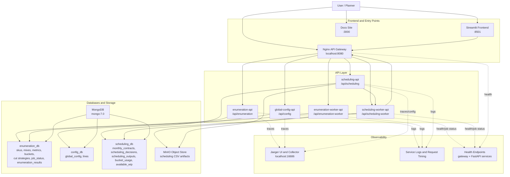

# API Runtime Diagram

This view is focused on the current Docker Compose runtime, with emphasis on the frontend, API layer, persistence, and observability.

## Diagram

## What This Diagram Shows

- `streamlit-app` is the main interactive frontend and talks to the stack through the gateway rather than calling service ports directly.
- `api-gateway` is the single public API surface on `http://localhost:8080` and routes traffic to all five backend services.
- The API layer is split between CRUD-style domain APIs and worker APIs for long-running jobs.
- MongoDB is the system of record, separated into `enumeration_db`, `config_db`, and `scheduling_db`.
- MinIO is a sidecar persistence layer used by the scheduling workflow for CSV artifacts.
- Observability in the current Compose stack is primarily Jaeger tracing, FastAPI/gateway health endpoints, and application logs with request timing.

## Runtime Notes

- `scheduling-worker-api` depends on other APIs through the gateway for upstream reads and downstream persistence.
- `scheduling-api` does not expose raw object-store URLs directly; it proxies artifact listing and downloads for clients.
- `enumeration-worker-api` and `scheduling-worker-api` each allow only one active job per process today.
- Prometheus and Grafana are mentioned in design material, but they are not part of the running Compose stack shown here.
